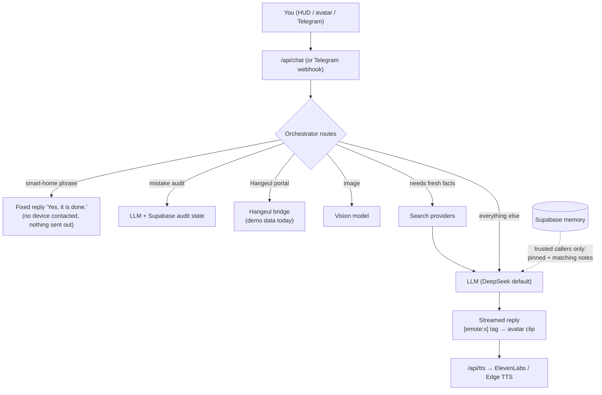

# Data flow: what Jeannie collects, where it goes, and why

**In plain words:** Jeannie only knows what you give her: what you type or say, pictures you show her,
notes you upload, and Telegram messages from the admin chat. To answer, she sends your message to an AI
company's model (DeepSeek by default), sometimes to a web search company, and her reply text to a voice
company. Only your uploaded notes and a little audit bookkeeping are stored, in your Supabase database.
Chat history lives only in the open browser tab. A bigger store of student records is **planned but not
built**; when built, it would put full student personal data in Supabase, on your phone and in front of
DeepSeek. Risks are listed at the end.

## 1. What is collected, by input

| Input | Collected where | Sent to | Stored? |
|---|---|---|---|
| Typed chat message | HUD / avatar screen | `/api/chat` → LLM provider | No. The browser tab keeps the conversation in memory only; the server keeps nothing |
| Image (upload or camera frame) | `CameraScanner`, file picker; downscaled to ≤1280 px JPEG in the browser (`lib/client/image.ts`) | `/api/chat` → vision model | No |
| Voice (microphone) | Browser Web Speech API (`useSpeechRecognition.ts`) | The **browser vendor** turns it into text (Chrome uses Google's servers); only the text reaches Jeannie | No (Jeannie never receives audio) |
| Jeannie's spoken reply | Reply text, shortened for speech (`lib/client/speech-text.ts`) | `/api/tts` → ElevenLabs, or Microsoft Edge TTS; else the browser speaks it locally | No |
| Uploaded notes (`.md`, `.jsonl`, ≤1 MB) | Memory panel or `npm run memory:upload` | `/api/memory` → Supabase | **Yes**, until you delete them |
| Telegram message or photo | Telegram → `/api/telegram/webhook` | Admin chat only: orchestrator → LLM / vision model; photos downloaded from Telegram for that one answer | Only audit approval state (see §3) |
| "How long were you away" | `localStorage` timestamp (`useLastSeen.ts`) | `/api/session?awayMs=` → LLM, for the greeting | In the browser only |
| Access key | Typed once into the access dialog | Every `/api` request header | In the browser's `localStorage` |

Nothing collects location (`Permissions-Policy` blocks geolocation), contacts, or files you did not pick.

## 2. Where each flow goes, and why

| Flow | Path in code | Leaves to | Why |
|---|---|---|---|
| Chat answer | `api/chat/route.ts` → `agents/orchestrator.ts` → `agents/llm.ts` | DeepSeek, or Anthropic / OpenAI / an OpenAI-compatible URL / Ollama, whichever is configured | The model writes the answer. It receives the last 20 messages, the system prompt (persona, time, recalled memory) and any tool results |
| Image | `orchestrator.ts` `runVision` → `agents/vision-agent.ts` | Claude or OpenAI if their key is set, else DeepSeek's vision model | DeepSeek's chat model cannot read images |
| Live search | `agents/search-agent.ts` | DeepSeek web search → Tavily → Google CSE → DuckDuckGo (first that works) | Fresh facts the model cannot know. Only the search query is sent (the model may rewrite it from recent turns) |
| Read a web page | `agents/read-url.ts` | `r.jina.ai` (renders the page), else a direct fetch | The model asked to read a URL. Private / localhost addresses are refused |
| Time questions | `agents/time-tools.ts` | Nothing | Pure date arithmetic |
| Smart-home phrase | `agents/iot-interceptor.ts` | Nothing | Hard rule: answered with a fixed sentence, no device is contacted |
| Memory recall | `memory/store.ts` `recallMemory` | Supabase (read), then into the LLM prompt | Personal context. Only for **trusted** callers (valid access key, cron secret, or Telegram admin chat); up to 3 pinned notes (≤3,000 chars) plus up to 6 full-text matches |
| Greeting | `api/session` → `agents/greeting.ts` | LLM | A short Korean opening line for the time of day and how long you were away (one recalled item for trusted callers) |
| Voice | `api/tts` → `agents/tts-engine.ts`, `agents/edge-tts.ts` | ElevenLabs, else Microsoft Edge (`speech.platform.bing.com`) | Natural voice; the browser voice is the free fallback |
| Hangeul report | `api/hangeul` → `agents/hangeul-bridge.ts` | The Hangeul portal URL with Basic auth (only if configured, trusted, and `MOCK_MODE` off); otherwise demo data made up in code | The daily operations summary. Today it is **demo data** (labelled as such) because the portal has no such API |
| Daily report | Vercel cron 03:00 UTC → `api/hangeul` → `telegram.ts` `notifyAdmin` | Telegram admin chat | Morning briefing on the phone |
| Telegram | `api/telegram/webhook` → `telegram.ts` | Telegram Bot API (replies), and the same LLM/search flows as chat | Use Jeannie from Telegram. Non-admin chats get a "private" line and nothing else; with no admin chat set, nothing costly runs |
| Status | `api/status` | Nothing | Tells the page which features are on (booleans and model names only) |

## 3. What is stored in Supabase today

Every table has row-level security on with **no policies**, and the public `anon`/`authenticated` roles are
revoked. Only the server's secret key can read or write (`supabase/migrations/*`).

| Table | Holds | Written by | Kept |
|---|---|---|---|
| `memory_documents` | One row per uploaded note: file name, title, kind, pinned, full text, size | `/api/memory` (upload replaces a same-name file) | Until deleted in the Memory panel |
| `memory_chunks` | The note split into searchable pieces (heading, text, keywords; full-text index) | Same, via `upsert_memory_document` | Deleted with the note |
| `jeannie_sessions` | Per Telegram chat (`telegram:<chat id>`): idle or awaiting approval, and the pending audit reply | Telegram mistake-audit flow | Overwritten each time; a pending reply older than 30 minutes is ignored |
| `jeannie_audit_log` | Each approve/reject decision: chat key, decision, the audited items | Telegram audit flow | Kept indefinitely |

Upload guard: `memory/chunk.ts` refuses files that look like they contain secrets (API keys, GitHub / Slack /
Telegram tokens) or ID numbers (passport, NID, TIN, birth registration).

## 4. What stays on the device

| Where | What |
|---|---|
| `localStorage` | The access key (`lib/client/api.ts`), language and voice toggles, desktop layout and view mode, last-seen time, chosen outfit |
| Service worker cache `jeannie-v3` | App shell, avatar clips, icons, Next.js static files. Never `/api` responses |
| Memory of the open tab | The chat conversation (lost on reload) |

## 5. Third parties that receive data

| Service | Receives | When |
|---|---|---|
| DeepSeek (default model) | Messages, system prompt with recalled notes, tool results, images (vision fallback), search queries | Every model answer |
| Anthropic / OpenAI / custom OpenAI-compatible endpoint / Ollama | Same as above | Only if configured instead of, or alongside, DeepSeek |
| Tavily, Google Custom Search, DuckDuckGo | Search queries | Search turns |
| Jina Reader (`r.jina.ai`) | URLs the model reads | When the model reads a page |
| ElevenLabs, Microsoft Edge TTS | Reply text (spoken part) | When the server voice is on |
| Browser vendor (e.g. Google for Chrome) | Microphone audio | While you hold to talk |
| Telegram | Messages and replies in the admin chat; the daily report | Telegram use |
| Supabase | Uploaded notes, audit state | Memory and audit features |
| Vercel | All requests pass through its functions (logs carry error names only) | Always |
| Hangeul portal | Basic-auth credentials and report requests | Only if configured (not today) |

## Planned: Hangeul cloud context (not built)

> **Status: planned, not built.** The tables exist (migration `20260929030000_hangeul_context.sql`) but no
> code writes or reads them. Source: `.scratch/hangeul-cloud-context/spec.md` and `hangeul-bot-prompt.md`.

**Goal:** answer questions about the agency's students from the phone instantly, without the office PC
being awake.

**Planned path:**

1. Hangeul BOT on the office PC reads `hangeul.com.bd/admin` (student lists, profiles, payments, passport
   audits, document checks, consultations, reports).
2. It publishes every parsed field, **unmasked**, to Supabase through `hg_sync`.
3. The phone keeps a **full copy** in IndexedDB (`jeannie-hg`).
4. Code builds the facts for each answer; DeepSeek receives the question **and the values, personal data
   included**, and writes the sentences around them (spec decisions D2, D9, D11).

**Tables:**

| Table | Holds |
|---|---|
| `hg_runs` | One row per bot job: job name, start/end, status, counts |
| `hg_records` | Latest state of every entity, keyed by `(kind, key)`: `student_uid`, `student_hng_id`, `student_name`, `passport_no`, `day`, `data` (every parsed field), `content` (text form), `source`, `read_at` |
| `hg_chunks` | 384-dimension `gte-small` embeddings of each record's text, for semantic search |
| `hg_changes` | Change log (filled by a trigger) for syncing devices |

Record kinds include `student`, `student_export`, `student_profile`, `student_progress`,
`student_documents`, `verification`, `consultation`, `pending_payment`, `passport_audit`, `passport_alert`,
`doc_verdict`, `field_check`, `field_correction`, `report`, `report_section` and `brief_fact`.

**Example rows. FAKE: example only. No real person.**

| kind | key | student_hng_id | student_name | passport_no | day | data (excerpt) |
|---|---|---|---|---|---|---|
| `student` | `0` | `HNG-0000-0` | TEST STUDENT | `X0000000` | — | `{"phone": "+880 1700-000000", "dob": "2000-01-01", "father": "TEST FATHER", "status": "FAKE"}` |
| `verification` | `0` | `HNG-0000-0` | TEST STUDENT | `X0000000` | `2000-01-01` | `{"verifier": "TEST", "amount": 0, "method": "FAKE"}` |

## Risks and suggested fixes

| # | Risk | Today / planned | Suggested fix |
|---|---|---|---|
| 1 | **One shared access key.** Anyone with it can use the chat, read and delete all memory notes, and (once built) read every student record. It sits in `localStorage` on each device that entered it | Today | Rotate it if it was ever shared or pasted (Vercel env var, then redeploy). Longer term: per-device keys or a real login (the spec chose not to, D8) |
| 2 | **API is open if `JEANNIE_ACCESS_KEY` is unset.** Chat, search and voice then work for anyone who finds the URL (billing exposure), though memory and live Hangeul stay locked | Today | Always set the key on any public deployment |
| 3 | **Notes go to the model provider.** Recalled notes are part of the prompt sent to DeepSeek (or whichever provider) | Today | Keep sensitive notes out of memory; the upload guard only catches obvious keys and ID numbers |
| 4 | **Full student personal data in three places** (Supabase, phone IndexedDB, DeepSeek prompts), unmasked | Planned | Before building, reconsider masking passport and phone in prompts, encrypting the phone copy, and a retention limit. The spec records these as accepted risks |
| 5 | **A leaked key cannot claw back synced data.** Rotation stops new reads; data already on a device stays | Planned | Add a wipe: the app clears its local copy whenever the server answers 401 (key rotated) |
| 6 | **Third-party retention.** DeepSeek, ElevenLabs, search providers and Jina keep data under their own policies | Today | Review each provider's data-retention settings; use a provider with zero-retention terms for sensitive turns |
| 7 | **Secrets exposed in chats.** The spec notes the office PC's `.env` and a Google token were pasted in chats and rotation was deferred | Today | Rotate those secrets |
| 8 | **`jeannie_audit_log` grows forever** | Today | Add a retention period if it starts holding sensitive items |
| 9 | **No CI.** A bad push reaches preview without automatic checks; production only on merge | Today | Add a GitHub Action running typecheck, lint, test and build on every PR |
| 10 | **`/api/status` is open** | Today, by design | Fine: it returns only booleans and model names, never secrets |
