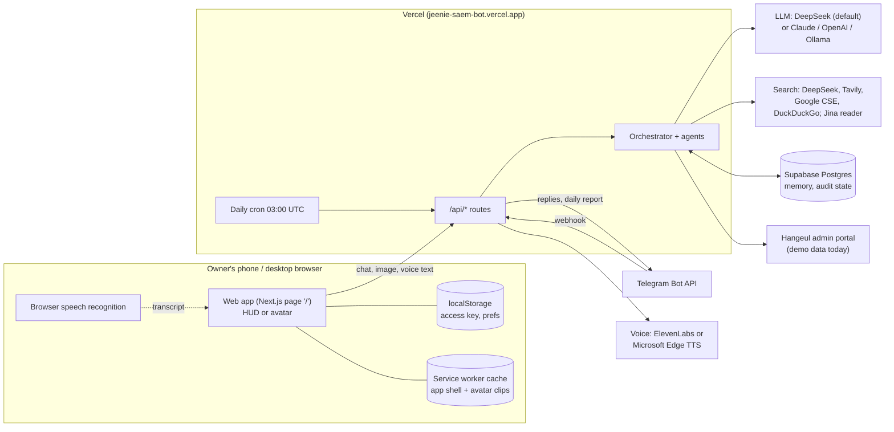

# Overview

**In plain words:** Jeannie is a private, bilingual (Korean and English) assistant for one person, the
owner, addressed as 부장님 (or 자기야 in personal moments). You talk to her in a web app: on a phone she is
an animated avatar, on a desktop a "HUD" control screen. She can chat, read pictures, search the web, speak,
remember notes you upload, answer in Telegram, and send a daily Hangeul report. The app runs on Vercel; her
"brain" is a language model (DeepSeek by default) reached over the internet.

## The moving parts

## What each part does

- **Web app** (`src/app/page.tsx`): one page. On phones it shows the avatar screen, on desktops the HUD
  (with a `1 | 2` switch between the classic HUD and the avatar). It is installable as a PWA.
- **API routes** (`src/app/api/*`): the server side. Chat, greeting, search, voice, memory, Hangeul report,
  Telegram webhook and a public status check. See [site-map.md](site-map.md).
- **Orchestrator** (`src/lib/agents/orchestrator.ts`): decides which specialist answers each message
  (smart-home, mistake audit, Hangeul, vision, live search, or the core chat agent) and streams the reply.
- **Memory** (`src/lib/memory/*`, Supabase): notes the owner uploads; relevant ones are added to the model's
  instructions for trusted callers.
- **Avatar** (`src/lib/avatar/*`, `public/avatar/*`): pre-rendered video clips (Kling) driven by a small state
  machine; replies open with an `[emote:…]` tag that picks the clip. See [`../CONTEXT.md`](../CONTEXT.md).
- **Telegram** (`src/lib/telegram.ts`): the same assistant in a private admin chat, plus the daily report.
- **Hangeul bridge** (`src/lib/agents/hangeul-bridge.ts`): the agency's admin-portal report. Today it serves
  clearly labelled demo data; a cloud data store for real records is designed but not built (see
  [data-flow.md](data-flow.md#planned-hangeul-cloud-context-not-built)).

## Who can use it

Everything except `/api/status` is behind one shared secret, `JEANNIE_ACCESS_KEY` (the HUD asks for it once).
Telegram only answers the one admin chat. Details and risks: [data-flow.md](data-flow.md#risks-and-suggested-fixes).
